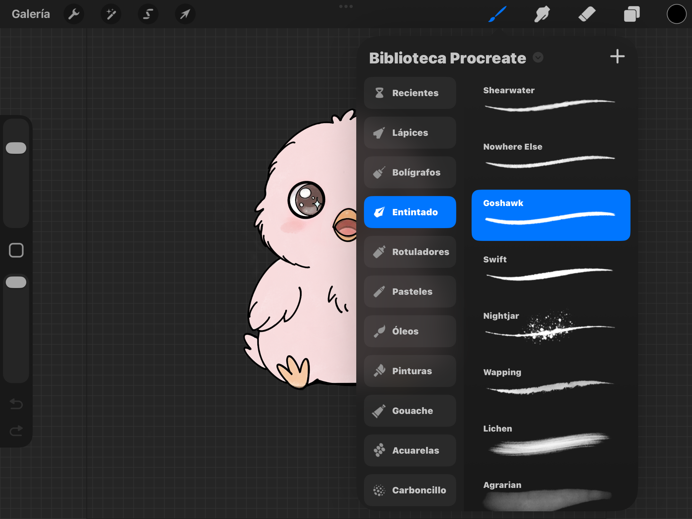

# Shake & Love

**Autor:** LyPaw (Manuel Fuentes Cruz)
**Ano:** 2026

Pagina web romantica y minimalista construida con HTML, CSS y JavaScript puro, sin frameworks ni backend. El destinatario accede a una escena interactiva donde un pollito duerme sobre una caja; al agitar el movil, el pollito despierta y la caja se abre revelando un mensaje personalizado.

---

## Aviso Legal

Copyright 2026 LyPaw (Manuel Fuentes Cruz). Todos los derechos reservados.

Se permite el uso personal y no comercial de esta aplicacion. Queda prohibida la distribucion, reproduccion, modificacion y uso comercial total o parcial sin autorizacion expresa por escrito del autor. El codigo fuente se proporciona unicamente como referencia tecnica.

---

## Arquitectura

Aplicacion estatica de una sola pagina (SPA) desplegada en GitHub Pages. No hay servidor backend; toda la logica se ejecuta en el navegador.

```
index.html          -> Estructura HTML (dos pantallas: creacion y propuesta)
style.css           -> Estilos CSS con paleta pastel y animaciones
script.js           -> Logica completa: interaccion, fisica, sonido, almacenamiento
assets/             -> Imagenes PNG/SVG del pollito, cofre, objetos, logo
```

## Diseño

Los assets graficos del pollito, cofre y demas elementos fueron dibujados manualmente en Procreate (iPad) con fondo transparente y exportados como PNG.



Paleta de colores utilizada:

| Variable | Color | Uso |
|----------|-------|-----|
| `--pink-light` | #FFE4EC | Fondo principal, bordes |
| `--pink-medium` | #FFB6D3 | Botones, acentos |
| `--pink-dark` | #FF8BBE | Textos destacados, titulos |
| `--cream` | #FFF5F7 | Fondos de input, textura |
| `--gold` | #FFD700 | Destellos, confeti |
| `--text-dark` | #5A4A5A | Texto principal |
| `--text-light` | #8A7A8A | Texto secundario, relojes |

Los objetos interactivos (almohada, peluche) se crearon como SVGs minimalistas con la misma estetica pastel. Los emojis (estrella, flor, corazon, pluma) se usan directamente como elementos del DOM con `font-size` grande y `drop-shadow` para integrarlos visualmente con los assets dibujados.

Las decoraciones de fondo (estrellas, nubes, hojas, destellos) son SVGs inline en el HTML con animaciones CSS sutiles (flotacion, deriva horizontal, caida con rotacion) para dar vida a la escena sin sobrecargar la interfaz.

## Flujo de Experiencia

```
Pantalla de Creacion                  Pantalla de Propuesta
+-------------------+                 +-------------------+
| Formulario con    |   URL params    | Relojes (tz)      |
| nombre + mensaje  | ------------->  | Escena interactiva |
| + zonas horarias  |  ?sender=...   | Pollito durmiendo  |
|                   |  &message=...  | Caja cerrada       |
| Boton "Generar"   |  &tz=...       | Objetos arrastrables|
+-------------------+                 +-------------------+
                                            |
                                      Agitar movil (5x)
                                            |
                                      Pollito despierta
                                      Caja desaparece
                                            |
                                      Mensaje visible
                                      Botones Si / No
```

## Fisica Ice-Rink (Objetos Arrastrables)

Los 6 objetos interactivos (almohada, peluche, estrella, flor, corazon, pluma) utilizan un sistema de fisica basado en un modelo "pista de hielo":

- **Friccion:** 0.992 (los objetos deslizan y se frenan gradualmente)
- **Rebote:** 0.7 (al chocar contra los limites de la escena)
- **Calculo de velocidad:** Se mide la distancia recorrida entre frames y se divide por el tiempo transcurrido, normalizado a 16ms (aprox. 60fps)
- **Correccion de coordenadas:** Se usa `getBoundingClientRect()` del contenedor `#scene` para restar el offset del viewport, evitando deriva de gravedad
- **Touch events:** Se registran tanto `mousedown/touchstart` para compatibilidad con escritorio y movil

La animacion se ejecuta via `requestAnimationFrame` en un loop continuo que aplica friccion, rebote y colision con los bordes.

## Sonido (Web Audio API)

Los sonidos se generan programaticamente con la Web Audio API, sin archivos de audio externos:

| Objeto | Tecnica |
|--------|---------|
| Almohada | Oscilador sine 150Hz con decaimiento exponencial |
| Peluche | Sine 800Hz con sweep rapido a 1200Hz y vuelta |
| Estrella | Sine 800Hz descendiendo a 400Hz en 0.5s |
| Flor | Ruido blanco filtrado con bandpass a 2000Hz |
| Corazon | Sine 80Hz con envolvente de doble pulso (latido) |
| Pluma | Sine 600Hz descendiendo a 200Hz en 0.3s |

Los sonidos de "Si" y "No" usan secuencias de notas y osciladores descendentes. Todos los sonidos se envuelven en bloques `try/catch` para no afectar la experiencia si el navegador bloquea el AudioContext.

## Deteccion de Sacudida (DeviceMotion API)

- Se usa `DeviceMotionEvent` para acceder al acelerometro del dispositivo
- En iOS 13+, se requiere `DeviceMotionEvent.requestPermission()` en respuesta a una interaccion del usuario (click)
- El umbral de deteccion es `speed > 25` (calculado como la variacion absoluta de aceleracion incluyendo gravedad)
- Se ignoran eventos con menos de 100ms de diferencia para evitar duplicados
- Se requieren 5 sacudidas consecutivas para despertar al pollito
- En escritorio, las teclas Espacio y Enter simulan una sacudida

## Sistema de Relojes (Zonas Horarias IANA)

- Se pobla un `<select multiple>` con todas las zonas horarias soportadas por `Intl.supportedValuesOf('timeZone')`
- Las zonas se agrupan por continente en `<optgroup>` (Africa, America, Asia, Europe, etc.)
- Los relojes se muestran en la parte superior de la pantalla de propuesta
- Se actualizan cada 15 segundos usando `toLocaleTimeString('es-ES', { timeZone: zone })`
- Formato: `CiudadName HH:MM`
- Las zonas se pasan como parametro URL: `?tz=Europe/Madrid,America/Mexico_City`

## Almacenamiento Local (localStorage)

- Cada vez que la caja se abre, se registra en `localStorage` con una key basada en la fecha actual
- Formato de la key: `box_{sender}_{message}_{YYYY-MM-DD}`
- Esto permite que la caja solo se pueda abrir una vez por dia por cada enlace
- Si la caja ya fue abierta hoy, el pollito permanece dormido y la caja invisible
- En modo preview (`?preview=true`), se ignora el control diario

## Seguridad

- **XSS:** Se usa `textContent` (no `innerHTML`) para inyectar el nombre y mensaje del remitente, lo cual escapa automaticamente el HTML
- **Sanitizacion:** Los parametros URL se sanitizan con una funcion que elimina tags HTML y limita la longitud
- **Validacion de timezone:** Solo se aceptan zonas IANA validas via `Intl.supportedValuesOf`
- **Content Security Policy:** Se incluye meta CSP que restringe fuentes a `'self'` con excepciones para WhatsApp
- **localStorage:** Las keys se sanitizan para evitar caracteres problematicos

## Responsive

La aplicacion se adapta a tres breakpoints:

| Breakpoint | Pollito | Caja | Objetos | Mensaje |
|------------|---------|------|---------|---------|
| < 480px | 216px | 180px | 108px | 2.3rem |
| 480-768px | 270px | 216px | 144px | 2.9rem |
| > 768px | 324px | 252px | 180px | 3.6rem |
